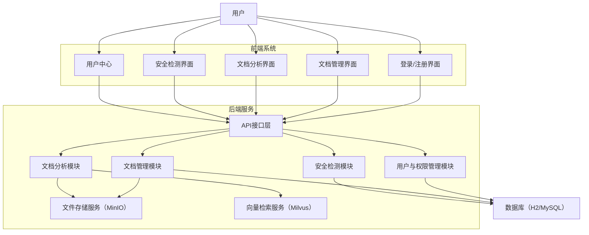

# 智能文档系统V1.0 使用说明

## 一、引言
随着信息化进程的不断加快，文档数据在各类组织和个人工作中的重要性日益凸显。传统的文档管理方式已难以满足现代社会对高效、智能、安全处理文档的需求。面对文档数量激增、内容复杂多样、信息安全风险加剧等挑战，亟需一种能够实现文档智能化管理与分析的系统。智能文档系统正是在此背景下应运而生，旨在通过人工智能与自动化技术，提升文档处理的效率和质量，助力用户在信息时代中高效获取和利用知识。

## 二、编写目的
本使用说明书的编写旨在为智能文档系统的用户、开发者及维护人员提供详尽的指导和参考。通过对系统架构、功能模块、操作流程及注意事项的系统性阐述，帮助用户快速理解和掌握系统的安装、配置与使用方法，确保各项功能能够被充分利用。同时，本说明书也为后续系统的维护、升级和扩展提供技术依据，降低学习和运维门槛，提升整体服务质量。

## 三、系统创新点
智能文档系统在设计与实现过程中，充分融合了人工智能、自然语言处理（NLP）、向量检索、云存储等现代技术。系统不仅支持多维度的文档内容分析，如自动关键词提取、智能摘要生成、内容润色建议和安全风险检测，还实现了文档的智能管理与细粒度权限控制，极大提升了数据安全性。通过可视化的分析结果展示，用户能够直观地理解文档内容与结构。此外，系统采用前后端分离架构，便于功能扩展和维护，能够灵活适应不同规模和场景的应用需求。

## 四、系统需求描述
智能文档系统对软硬件环境有一定要求。系统支持在主流操作系统（包括Windows、macOS和Linux）上部署和运行。后端服务需安装JDK 17及以上版本，前端开发与运行需安装Node.js 16及以上版本。为保证最佳体验，建议用户使用Chrome、Edge等现代浏览器访问系统前端。系统默认集成H2数据库以便开发和测试，实际部署时可根据需求扩展为MySQL等主流数据库，以满足更大规模的数据存储和访问需求。文件存储采用MinIO对象存储服务，向量检索支持Milvus，智能分析能力基于LangChain4j与OpenAI模型。

## 五、应用开发环境
本系统后端采用Java 17语言，基于Spring Boot框架开发，项目管理工具为Maven。后端集成了Spring Security实现安全认证，使用Lombok简化代码，采用MinIO进行文件存储，Milvus用于向量检索，LangChain4j与OpenAI API提供智能分析能力。前端部分基于React 18开发，依赖Node.js和npm进行包管理和构建，UI采用Ant Design组件库，前后端通过RESTful API进行通信。数据库层默认使用H2，支持扩展为MySQL等关系型数据库。开发过程中推荐使用IntelliJ IDEA、VS Code等主流开发工具，以及Postman等接口调试工具，以提升开发效率和代码质量。

## 六、概述
智能文档系统整体采用前后端分离的架构模式，后端负责核心业务逻辑处理、数据存储与安全保障，前端则为用户提供友好的交互界面。系统支持文档的上传、管理、内容分析、权限控制等核心功能，能够满足用户在文档全生命周期中的多样化需求。通过模块化设计，系统具备良好的可扩展性和可维护性，能够根据实际业务场景灵活调整和升级。后端API接口文档通过Knife4j自动生成，便于开发者查阅和调试。

## 七、总体模块框架

## 八、模块描述
智能文档系统由多个功能模块协同构成，各模块分工明确、相互配合。文档管理模块负责文档的上传、下载、删除、分类与检索，支持多种主流文档格式（如PDF、Word、Excel、PPT、图片、文本等），并通过MinIO对象存储实现高效安全的文件管理。文档分析模块基于LangChain4j与OpenAI模型，结合NLP技术，能够自动提取文档关键词、生成内容摘要，并为用户提供多种风格的智能润色建议，帮助提升文档质量。安全检测模块则对文档内容进行敏感信息识别与安全风险评估，生成安全分析报告，辅助用户规避潜在风险。用户与权限管理模块实现了用户的注册、登录、信息维护、头像上传、密码修改及文档访问权限的细粒度控制，保障系统数据的安全性和合规性。所有数据均通过数据库进行持久化管理，支持数据的备份与恢复，确保系统运行的稳定性和可靠性。系统还集成了仪表盘与用户活动追踪功能，便于用户了解自身操作历史和系统使用情况。

---
如需详细操作说明，请参见后续章节或联系系统管理员。
